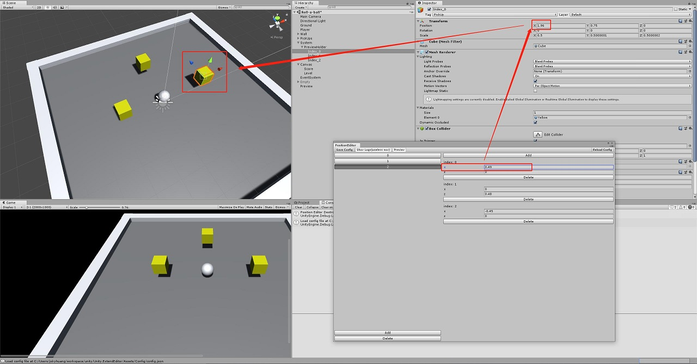
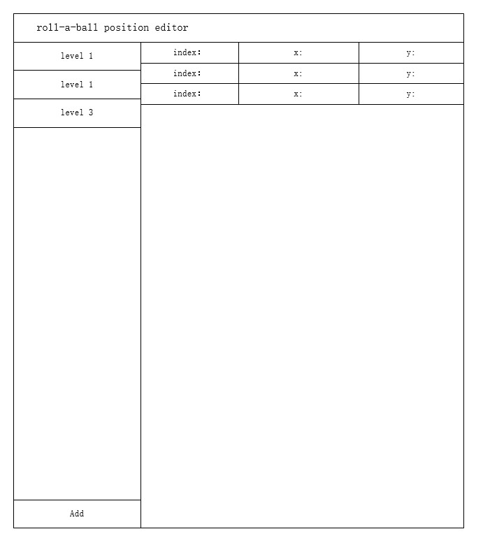

# extend-editor.superior
[]()
[]()
[]()
[](https://www.codefactor.io/repository/github/moons-project/unity.extendeditor)


## 概覽

Unity編輯器擴展的實踐，給轉球小游戲加一個關卡編輯器，并讓修改可以及時預覽。

<!--  -->

> 现在，你可以勾选预览选项并拖动数值实时在关卡中预览修改。




## 過程

分析數據流，最初的設計如下：



實際上發現想要的操作比設計上要多一些，所以額外加了一些按鈕，最後變成了上圖的樣子。

## 關鍵代碼

```csharp
public class PositionEditor : EditorWindow {
 [MenuItem("Jsky/Position Editor")]
  private static void ShowWindow() {
    EditorWindow.GetWindow(typeof(PositionEditor));
  }

  ...

  // root gui construct
  private void OnGUI() {
    // load data
    if (levelData == null) LoadEditorConfig();
    // gui variable
    // var width = Screen.width / (int) EditorGUIUtility.pixelsPerPoint;
    // var height = Screen.height / (int) EditorGUIUtility.pixelsPerPoint;

    OnGUI_TitlePart();
    GUILayout.BeginHorizontal();
    this.OnGUI_LevelPart();
    this.OnGUI_ItemPart();
    GUILayout.EndHorizontal();
  }

  ...

}
```

<!-- ## TODO

1. 更加複雜的關卡要素。
  + 消除方式變更，增加控制維度小球環繞遠近。（同時適應移動端增加搖桿）
  + 關卡地形增加Z軸維度。
  + 增加可互動元素
    + 機關
    + 多種的消除物
  + 增加關卡元素
    + 音樂
    + 提示
2. 與之適應的關卡編輯器。 -->
