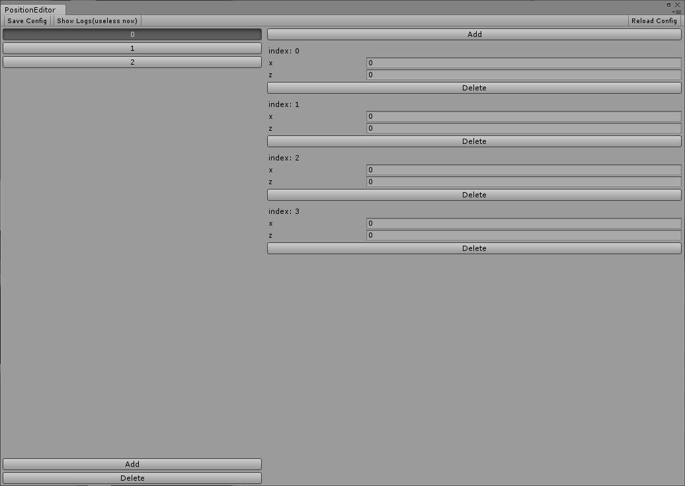

# extend-editor.basic
`jskyzero` `2017/12/01`

## 概覽

Unity編輯器擴展的實踐，給轉球小游戲加一個關卡編輯器。



## 過程

分析數據流，最初的設計如下：


實際上發現想要的操作比設計上要多一些，所以額外加了一些按鈕，最後變成了上圖的樣子。

## 關鍵代碼

```csharp
public class PositionEditor : EditorWindow {
 [MenuItem("Jsky/Position Editor")]
  private static void ShowWindow() {
    EditorWindow.GetWindow(typeof(PositionEditor));
  }

  ...

  // root gui construct
  private void OnGUI() {
    // load data
    if (levelData == null) LoadEditorConfig();
    // gui variable
    // var width = Screen.width / (int) EditorGUIUtility.pixelsPerPoint;
    // var height = Screen.height / (int) EditorGUIUtility.pixelsPerPoint;

    OnGUI_TitlePart();
    GUILayout.BeginHorizontal();
    this.OnGUI_LevelPart();
    this.OnGUI_ItemPart();
    GUILayout.EndHorizontal();
  }

  ...

}
```